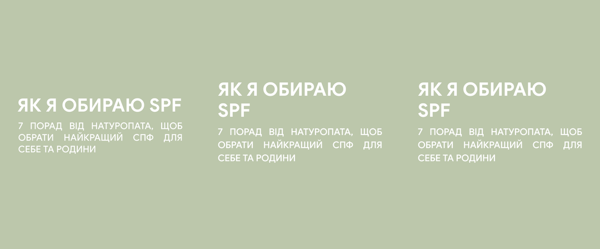
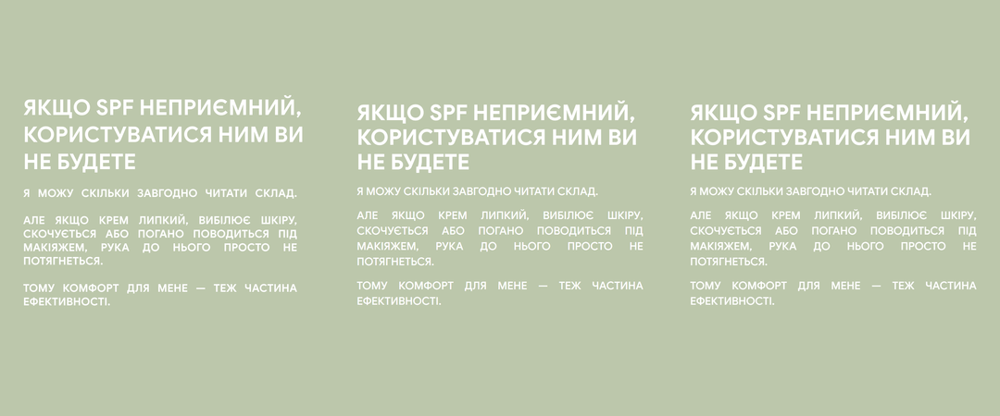
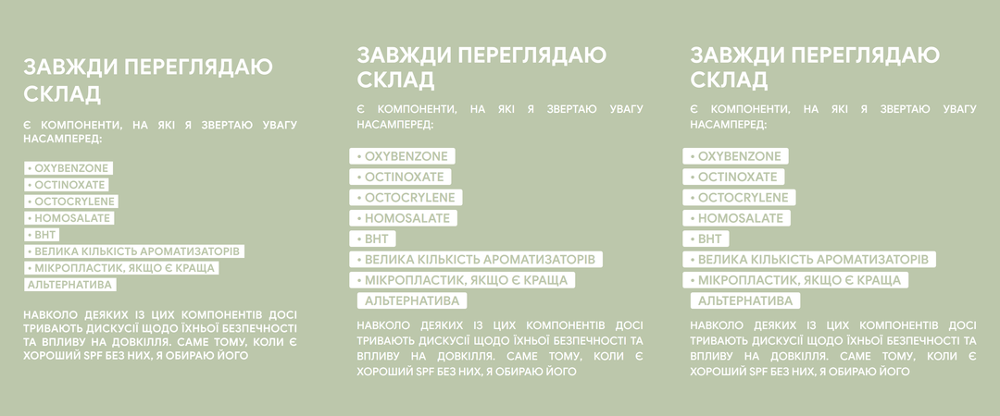
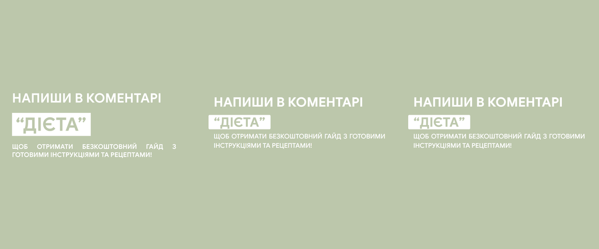
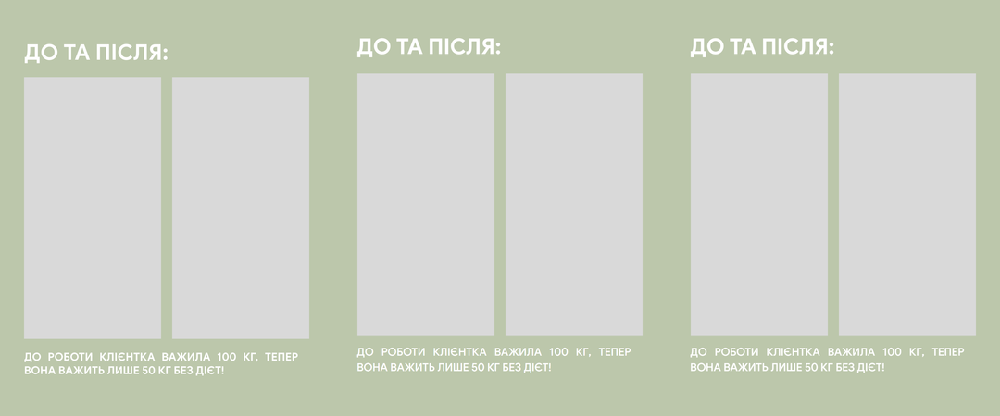
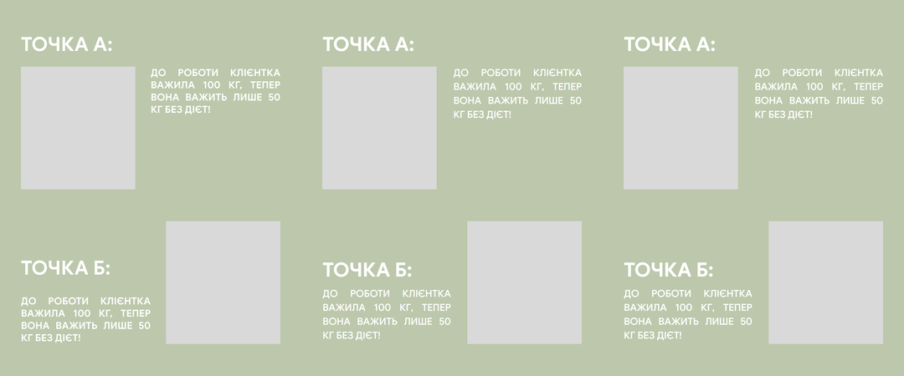
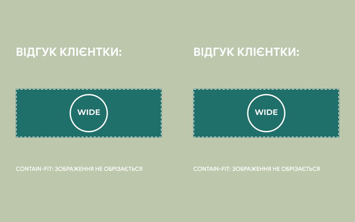
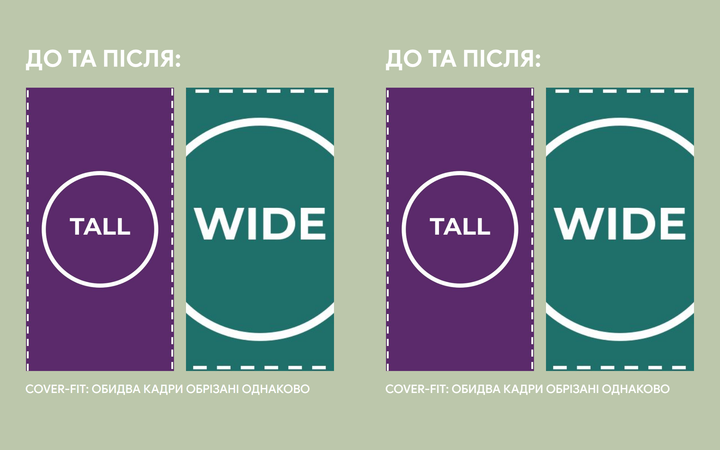
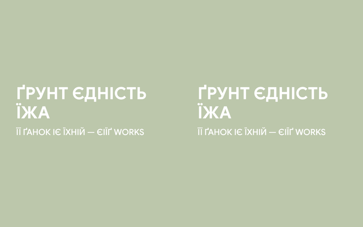
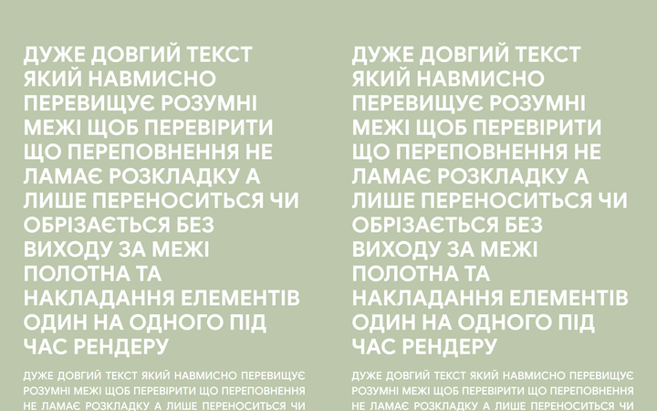

# Carousel Lab v2 — "Modern Elegant" — Build Report

**Branch:** `carousel-lab/modern-elegant`
**Status:** All acceptance benchmarks green (one authed-UI E2E gated on missing test credentials — verified at the data layer instead; see §12).
**Scope:** ONE style ("Modern Elegant") built as a fully isolated, parallel v2 engine. The existing carousel builder is untouched.

---

## 1. Guardrail compliance ✅

| Guardrail | Status |
|---|---|
| Never push to main; work on `carousel-lab/modern-elegant` | ✅ on branch, nothing pushed |
| Never trigger a production Vercel deploy | ✅ local dev only (`next dev` :3001) |
| Never read‑modify‑write / delete existing carousel code, table, storage, or export | ✅ **0 existing files modified or deleted** (`git status` verified) |
| DB changes ADDITIVE ONLY (new table, new storage path; no ALTER/DROP/RENAME/policy change on existing objects) | ✅ new table `carousel_lab_projects` + new bucket `carousel-lab` only; legacy `carousel_projects` row count unchanged (38) |
| Everything namespaced (`/carousel-lab`, `components/carousel-lab/`, `carousel_lab_projects`, `carousel-lab/`) | ✅ |

The entire change set is **new files** plus one **additive migration** (`supabase/migrations/028_carousel_lab_projects.sql`). No existing file was edited.

---

## 2. Architecture — single source of truth

The core is one pure function, **`buildSlideSvg(slide, { measure, imageSrc, embedFontCss })`** → an SVG string.

- **Editor** renders that SVG inline (scaled by viewBox) — `components/carousel-lab/LabSlideCanvas.tsx`.
- **Export** rasterizes the *same* SVG string (fonts embedded as base64, images inlined as data‑URIs) to PNG on a canvas — `lib/carousel-lab/exportPng.ts`.

Because both paths consume the identical SVG, **editor and export are pixel‑identical by construction** — not by coincidence. All word‑wrap and justification geometry is *baked* into the SVG using browser canvas metrics (`lib/carousel-lab/textLayout.ts` + `measure.ts`), so there is no font‑metric drift between preview and output.

**Font:** Google Sans (`@fontsource/google-sans`, already a dependency) loaded under a private family name `GoogleSansElegant` (served from `/lab-fonts/`, **not** `/carousel-lab/*` which middleware would redirect). It ships full Cyrillic subsets — **Ukrainian Ґ Є І Ї render correctly** (verified, §7 / `extras/cyrillic-ukrainian-sbs.png`). The private family name means the rest of the app (which references a bare, never‑loaded "Google Sans") is unaffected.

Isolation map:
```
app/carousel-lab/            list + editor routes + server actions (new table only)
components/carousel-lab/     LabEditor, LabSlideCanvas, StyleChooser, SlideTypePicker, LabFields, LabProjectsList
lib/carousel-lab/            types, tokens (parsed SVG values), textLayout, buildSlideSvg, fonts, measure, exportPng, persist, uploadImage, catalog, defaults
supabase/migrations/028_carousel_lab_projects.sql
public/lab-fonts/            Google Sans woff2 (latin/latin-ext/cyrillic/cyrillic-ext × 500/600/700)
app/lab-preview, lab-proof, lab-demo   dev-only PUBLIC harnesses (not linked from the app)
```

---

## 3. SVG → type/subtype inventory

The source of truth is 19 Figma SVG exports in `carousel designs/modern elegant/`. All are 1080×1350, solid `#BCC7AB` background, **all text outlined to vector paths** (so colours + slot geometry are pixel‑truth; the font identity comes from the typography rules). Image placeholders are `#D9D9D9` rects (exact x/y/w/h parsed).

| SVG file | Type | Subtype | Variant / picture pos |
|---|---|---|---|
| `title only.svg` | Cover | title | — |
| `title + text.svg` | Cover | title_subtext | — |
| `title+text.svg` | Text | paragraph | none |
| `title+text+image up.svg` | Text | paragraph | up |
| `title+text+image down.svg` | Text | paragraph | down |
| `title+bullets.svg` | Text | bullets | none |
| `title+bullets+image up.svg` | Text | bullets | up |
| `title+bullets+image down.svg` | Text | bullets | down |
| `title+numbers.svg` | Text | numbered | none |
| `title+numbers+image up.svg` | Text | numbered | up |
| `title+numbers+image down.svg` | Text | numbered | down |
| `stat+label.svg` | Numbers | stat | stat_large |
| `stat+label v2 (smaller number).svg` | Numbers | stat | stat_small |
| `CTA with keyword.svg` | CTA | keyword | — |
| `CTA with icons.svg` | CTA | icons | 4 parked placeholder circles |
| `screenshot.svg` | Testimonial | screenshot | contain‑fit slot 888×570 |
| `after.svg` | Testimonial | before_after | 2 cover slots 444×850 |
| `point A_B v2.svg` | Testimonial | point_ab | **diagonal** (canonical) |
| `point A_B.svg` | Testimonial | point_ab | stacked (alt variant) |

**Missing from the taxonomy (flagged, not fabricated):**
- **Text picture position `middle`** — no source SVG exists. The engine accepts it and renders a reasonable centered band, but it is **not fidelity‑verified**; the picker flags it in amber ("без Figma‑еталона — не звірена").

---

## 4. Fidelity method & metrics

For every sample I (a) rasterized the source SVG (`svg-reference/`), (b) rendered my editor SVG (`render/`), (c) rasterized my export (`export/`), and (d) diffed. `parity` = editor‑vs‑export mean abs per‑channel diff; `fidelity` = editor‑vs‑Figma. Scale 0–255, **lower is better**. (Metrics computed on 360×450 downscales, so the small non‑zero parity is pure resampling noise.)

| Slide | parity (→0) | fidelity (→0) |
|---|---|---|
| cover-title | 0.00 | 2.57 |
| cover-title-subtext | 0.00 | 4.98 |
| text-paragraph | 0.21 | 5.38 |
| text-bullets | 0.34 | 11.82 |
| text-numbered | 0.35 | 12.03 |
| numbers-stat | 0.07 | 4.82 |
| numbers-stat-small | 0.07 | 3.51 |
| cta-keyword | 0.07 | 4.35 |
| cta-icons | 0.05 | 2.65 |
| testimonial-screenshot | 0.07 | 2.47 |
| testimonial-before-after | 0.07 | 2.28 |
| testimonial-point-ab | 0.13 | 2.55 |
| text-paragraph-image-up | 0.16 | 4.72 |
| text-paragraph-image-down | 0.13 | 4.78 |
| text-bullets-image-up | 0.05 | 3.35 |
| text-bullets-image-down | 0.05 | 4.32 |
| text-numbered-image-up | 0.06 | 3.46 |
| text-numbered-image-down | 0.06 | 3.46 |

**Parity is effectively perfect for all 18** (≤0.35 = antialiasing only). Fidelity is strong; the higher bullets/numbered numbers are dominated by the reference's arbitrary vertical spacing (see §5) and occasional wrap‑point differences from the font cut — both within the "make it rule‑consistent" mandate.

Side‑by‑side proofs (**left = Figma reference · middle = my editor · right = my export**) are in `side-by-side/`. Representative:








Robustness proofs in `extras/` (**left = editor · right = export**):






---

## 5. Design inconsistencies I fixed (made rule‑consistent)

The brief said: *good‑looking but inconsistent → clean and rule‑consistent, and record the fix.*

1. **Left/content margin drift.** Source margins ranged 68–100px (`title only`=99, `CTA keyword`=68, `bullets`=75, `after`=78, `stat`=98…). Standardized to a two‑value system: **96px** for centered "hero" types (cover, numbers, testimonial title/caption) and **76px** for dense text/bullets/CTA. Recorded in `lib/carousel-lab/tokens.ts` `LAYOUT`.
2. **CTA "action‑with‑icons" body was left‑aligned & narrower** in the Figma, while every other body is justified. Standardized to **justified** per the typography rule (its short body now fits one line — visible in `side-by-side/cta-icons.png`).
3. **Body wrap width varied per slide.** Unified to a per‑type `maxTextW`.
4. **Bullet/keyword highlight motif** was implicit; formalized to a single rule: **white chip + background‑colour knockout text** (used identically for list chips and the CTA keyword).
5. **Vertical rhythm was hand‑placed** per slide. Replaced with a deterministic stack + strategy (center / top / half‑canvas) so spacing is consistent across a carousel instead of eyeballed per slide.
6. **Typography sizes** snapped to the stated rule everywhere: **Title 100 (cover) / 70 (slides)**, **Body 50 (cover) / 35 (slides)**, all‑caps, title left‑aligned, body justified.

---

## 6. Assumptions (engineering calls)

- **Font.** Used the app's own `@fontsource/google-sans` (Google Sans **with** Cyrillic) rather than a system "Google Sans". Loaded under `GoogleSansElegant` so the rest of the app is unaffected. This satisfies "Google Sans, must render Ukrainian Cyrillic."
- **Weights.** Title/label **700**, body **500**, chip/bullet **600** (read off the reference rasters). Line‑heights: title ×1.14, body ×1.42.
- **Colours (pixel‑sampled):** bg `#BCC7AB`, text/icons `#FFFFFF`, chip `#FFFFFF` with knockout text `#BCC7AB`, image placeholder `#D9D9D9`.
- **Justification** is true space‑distribution (last line of a paragraph stays left), computed from browser metrics and baked into the SVG.
- **CTA icons are PARKED** → 4 white outline placeholder **circles** (not sourced icons), per brief.
- **point A→Б** = diagonal (v2) is canonical; a "stacked" variant is offered in the picker (v1 SVG). Each side is label + image + justified text.
- **Storage:** the existing app has **no** storage bucket (images are base64 in JSONB). I introduced a **new** bucket `carousel-lab` (public read, owner‑scoped writes) at path `<uid>/<projectId>/<slideId>-<n>.jpg`, with an inline‑base64 fallback if upload is unavailable.
- **Text limits** documented in `tokens.ts` `LIMITS` and enforced via `maxLength` in the editor; overflow wraps/clips inside the canvas (proof: `extras/overflow-*`).
- **Dev harnesses** (`/lab-preview`, `/lab-proof`, `/lab-demo`) are public and unlinked; keep for future style work or delete freely.

---

## 7. Typography verification

- All caps everywhere (`toLocaleUpperCase('uk')`).
- Title left‑aligned, 100 on cover / 70 on slides; body justified, 50 on cover / 35 on slides — see any `side-by-side/*`.
- **Ukrainian Cyrillic incl. Ґ Є І Ї renders (no tofu):** `extras/cyrillic-ukrainian-sbs.png` ("ҐРУНТ ЄДНІСТЬ ЇЖА / Її ґанок іє їхній — ЄІЇҐ works").

---

## 8. Persistence — verified at two layers

Full authed‑UI E2E (login → create → hard reload) needs `E2E_*` seeded credentials that are **not provisioned** in this environment (the repo's own carousel persistence test is likewise a pure‑logic spec). Verified equivalently:

1. **Logic round‑trip** — `e2e/carousel-lab.logic.spec.ts` (4 tests, all pass): every sample slide, and type/subtype/variant/picturePosition/points/images, round‑trip **byte‑identical** through `slidesForDb → normalizeSlidesFromDb`; malformed rows normalize without throwing.
2. **Real DB round‑trip** — inserted a full multi‑slide payload into the live `carousel_lab_projects`, read it back, deleted it (no residue): `slides_identical = true`, nested Cyrillic (`"стало 50кг"`) and image `storagePath` preserved through JSONB.

Image persistence uses the new `carousel-lab` bucket (owner‑scoped RLS); export inlines the stored image as a data‑URI so rasterization never taints.

---

## 9. Additive migration (also `supabase/migrations/028_carousel_lab_projects.sql`, already applied)

```sql
CREATE TABLE IF NOT EXISTS carousel_lab_projects (
  id UUID PRIMARY KEY DEFAULT gen_random_uuid(),
  user_id UUID NOT NULL REFERENCES auth.users (id) ON DELETE CASCADE,
  name TEXT NOT NULL DEFAULT 'Нова карусель',
  style_id TEXT NOT NULL DEFAULT 'modern-elegant',
  slides JSONB NOT NULL DEFAULT '[]'::jsonb,
  created_at TIMESTAMPTZ NOT NULL DEFAULT now(),
  updated_at TIMESTAMPTZ NOT NULL DEFAULT now()
);
CREATE INDEX IF NOT EXISTS carousel_lab_projects_user_updated_idx
  ON carousel_lab_projects (user_id, updated_at DESC);
ALTER TABLE carousel_lab_projects ENABLE ROW LEVEL SECURITY;
-- own-row SELECT/INSERT/UPDATE/DELETE via auth.uid() = user_id  (4 policies)

INSERT INTO storage.buckets (id, name, public)
VALUES ('carousel-lab', 'carousel-lab', true) ON CONFLICT (id) DO NOTHING;
-- storage.objects: public read on bucket 'carousel-lab';
-- INSERT/UPDATE/DELETE restricted to (storage.foldername(name))[1] = auth.uid()::text  (4 policies)
```
Applied to project `ohhudfwwdcbpxryxmvmd` (matches `.env.local`). Post‑apply check: `lab_rows=0, legacy_rows_untouched=38, lab_bucket=true, lab_storage_policies=4`.

---

## 10. Acceptance checklist

| Benchmark | Result |
|---|---|
| Editor render matches source SVG (screenshot‑diff, both attached) | ✅ `side-by-side/` (18) |
| Export matches editor pixel‑for‑pixel (side‑by‑side saved) | ✅ parity 0.00–0.35; `render/` + `export/` + `side-by-side/` |
| Typography obeys rules; Cyrillic renders | ✅ §7 |
| Text limits enforced; overflow doesn't break layout | ✅ `LIMITS` + `maxLength`; `extras/overflow-*` |
| Image fit per subtype (contain vs cover; up/down; identical crop) | ✅ `extras/fit-*` |
| Persistence round‑trips (new table); images from new storage path | ✅ §8 (logic + real DB) |
| Style chooser global; per‑slide type+subtype+variant picker works & persists | ✅ `editor/01-initial.png`, `editor/03-live-edit.png`; persistence §8 |
| Empty & max‑length states render without breaking | ✅ `extras/empty-*`, `extras/overflow-*` |
| Editor + export button work end‑to‑end | ✅ `editor/` (live edit + `editor-exported-slide.png`) |

---

## 11. Cutover path (designed, NOT implemented)

The v2 table/engine are a drop‑in for a future swap:
1. **Routing swap** — point `/carousel` at the new list/editor (or 301) once all styles are ported. The engine is style‑agnostic (`styleId` column + `catalog.ts`); add styles by extending `tokens`/`buildSlideSvg` branches, no schema change.
2. **Optional data migration** — a one‑shot `carousel_projects → carousel_lab_projects` mapper (old slide model → `LabSlide`), additive; the old table stays as a read‑only fallback until retired.
3. No cutover code exists yet, by design.

---

## 12. Known limitation

- **Authed browser E2E** of the create→reload flow could not run (no `E2E_*` seeded credentials here). Mitigated by the logic + real‑DB round‑trips (§8) and the live editor demo (`/lab-demo`, `editor/`). With credentials, add a `mobile-chromium` spec that logs in, creates a lab project, edits, hard‑reloads, and asserts restored state — the UI + actions are already wired to the new table.

## 13. Reproduce the proofs
```bash
npm run dev                                   # :3001
node scripts/carousel-lab-proof/capture-fidelity.mjs      # reference|editor|export diffs
node scripts/carousel-lab-proof/capture-extras.mjs        # empty/overflow/fit/cyrillic
node scripts/carousel-lab-proof/capture-editor-demo.mjs   # editor UX + export button
PW_SKIP_WEBSERVER=1 npx playwright test --project=logic carousel-lab.logic   # persistence round-trip
```
